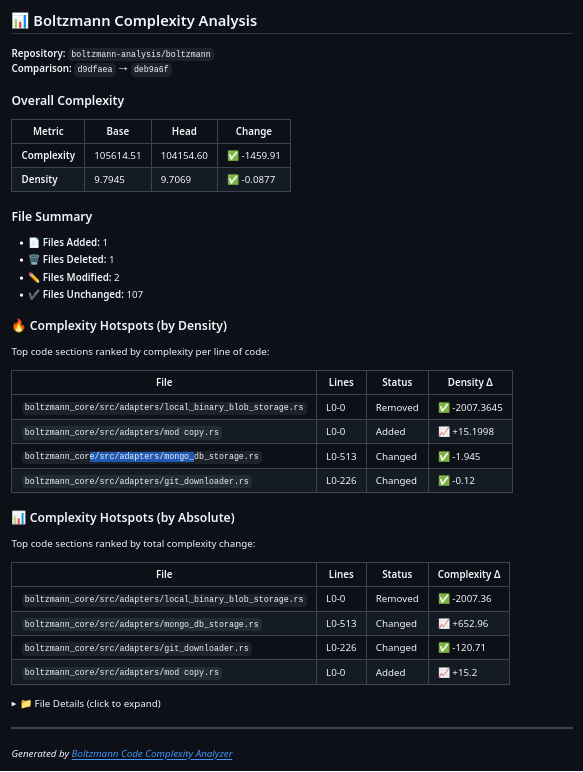

# Boltzmann Complexity Action

A GitHub Action that analyzes code complexity changes in pull requests using the [Boltzmann Code Complexity Analyzer](https://boltzmann.co.uk).

## Features

- Compares complexity between base and head commits
- Posts a detailed PR comment with:
  - Overall complexity and density changes
  - File summary (added/deleted/modified/unchanged)
  - Complexity hotspots ranked by density
  - Complexity hotspots ranked by absolute change
  - Detailed file-by-file breakdown

## Usage

Add this to your workflow (e.g., `.github/workflows/complexity.yml`):

```yaml
name: Complexity Report

on:
  pull_request:
    branches: ["main"]

permissions:
  pull-requests: write
  contents: read

jobs:
  analyze:
    runs-on: ubuntu-latest
    steps:
      - uses: boltzmann-analysis/boltzmann-complexity-action@v1
        with:
          github-token: ${{ secrets.GITHUB_TOKEN }}
```

## Inputs

| Input | Description | Required | Default |
|-------|-------------|----------|---------|
| `github-token` | GitHub token for posting PR comments | Yes | - |
| `api-url` | Boltzmann API URL | No | `https://api.boltzmann.co.uk/compare` |

The repository URL and commit SHAs are automatically detected from the workflow context.

## Example Output

The action posts a comment like this on your PR:



## License

MIT
